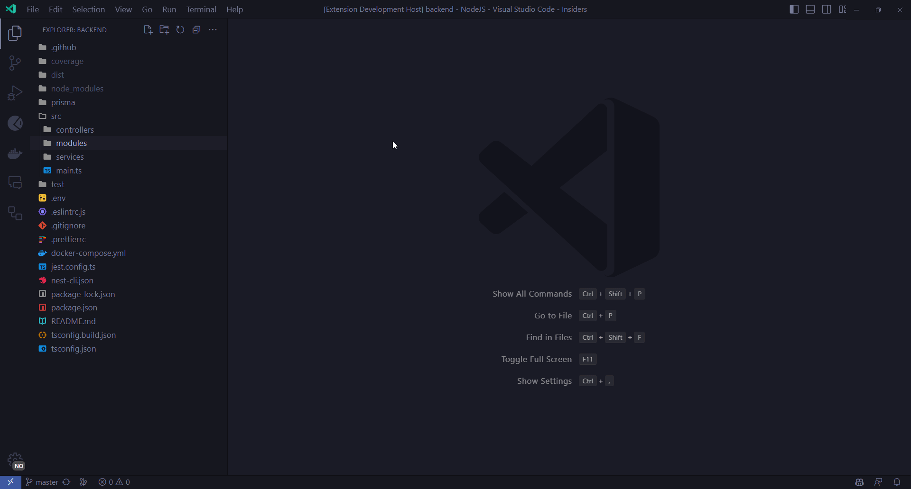

# NestJS Templates

VS Code extension to quickly create commonly used NestJS files via the Context Menu

## Features

In the context menu under the "NestJS" submenu, you will discover various additional options by right-clicking on any folder/file in your present project.

"NestJS" Folder Sub Menu Options  |
---           | 
Generate Controller |
Generate Module |
Generate Service |
Generate Exception |
Generate Middleware |
Generate Pipe |
Generate Interceptor |
Generate Decorator |
Generate Guard |
Generate Exception Filter |
Generate Transport |
Generate Adapter |
Generate Webpack |
Generate Gateway |

"NestJS" File Sub Menu Options  |
---           | 
NestJS - Generate Unit Test |

> Newly created files will also be registered in your app modules depending on the context

# License

MIT
